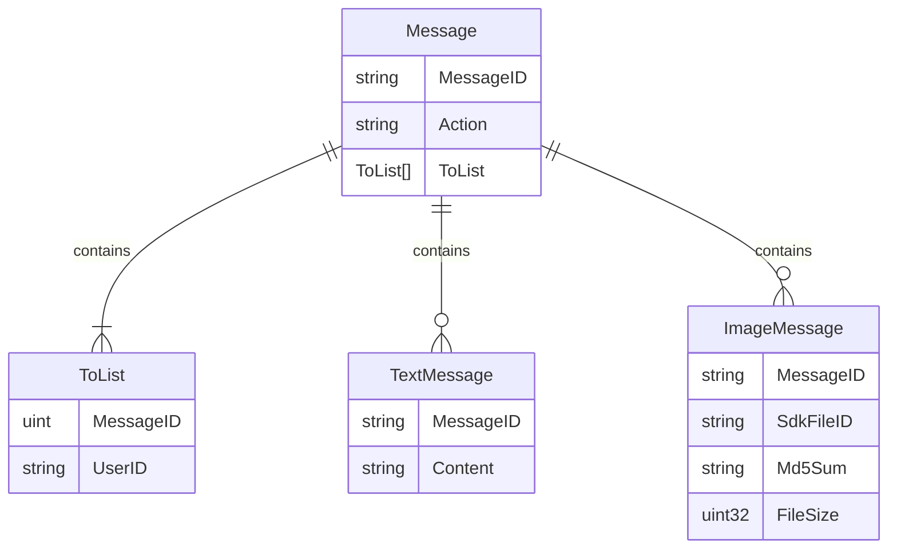

# README

## docker compose commands
### build image

> docker compose build --no-cache

### run container
> docker compose run linux-x86-64-env bash

or

> docker exec -it <container id> bash

```json
[
    {
        "seq":1,"msgid":"9798874904303189464_1711509046561_external",
        "publickey_ver":1,"message":
        {
            "msgid":"9798874904303189464_1711509046561_external",
            "action":"send",
            "from":"wm_i1DKgAAJLpEo9QlY8oUZQiapkd_Nw",
            "tolist":["XiangYe"],
            "msgtime":1711509041880,
            "msgtype":"text",
            "text":
            {
                "content":"我通过了你的联系人验证请求，现在我们可以开始聊天了"
            }
        }
    },
    {
        "seq":2,
        "msgid":"16219863938905299405_1711509059657_external",
        "publickey_ver":1,
        "message":
        {
            "msgid":"16219863938905299405_1711509059657_external",
            "action":"send",
            "from":"XiangYe",
            "tolist":["wm_i1DKgAAJLpEo9QlY8oUZQiapkd_Nw"],
            "msgtime":1711509055141,
            "msgtype":"text",
            "text":
            {
                "content":"你好"
            }
        }
    }
]
```

